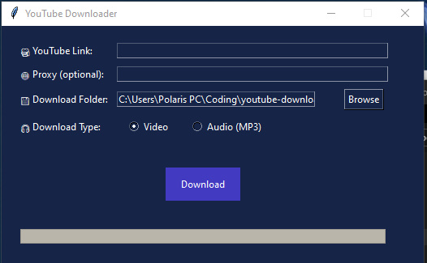

# 🎬 YouTube Downloader - Python GUI

**Simple, clean YouTube Video & Audio Downloader with Proxy support and GUI built using Tkinter.**

یک ابزار ساده و گرافیکی برای دانلود ویدیو یا صدا از یوتیوب، با قابلیت پشتیبانی از پراکسی و طراحی حرفه‌ای.

---


## 🚀 Features | ویژگی‌ها

✅ Download videos in highest quality  
✅ Extract audio only (MP3)  
✅ Proxy support (HTTP/SOCKS5) for bypassing restrictions  
✅ Auto-save user settings (proxy & folder)  
✅ Progress bar & modern dark theme  

✅ دانلود ویدیو با بالاترین کیفیت  
✅ استخراج فقط صدا (MP3)  
✅ پشتیبانی از پراکسی (HTTP/SOCKS5) برای عبور از فیلترینگ  
✅ ذخیره خودکار تنظیمات مسیر و پراکسی  
✅ نوار پیشرفت گرافیکی و طراحی تیره مدرن  

---

## 💻 How to Run | روش اجرا

**Install requirements:**  
پیش‌نیاز نصب:

```bash
pip install pytube
```
یا

```bash
pip install pytube
```

**Run the program:**  
اجرای برنامه:

```bash
python youtube_downloader_gui.py
```

**Or You can Run the executable file**


---

## 🖥 EXE Ready Version | نسخه آماده برای ویندوز

[⬇️ Download EXE file](https://your-link.com/youtube_downloader_gui.exe)  

⚠️ Make sure VPN or Proxy is enabled before use.  
⚠️ قبل از استفاده، حتما فیلترشکن یا پراکسی را فعال کنید.

---

## 🔧 Build Your Own EXE | ساخت فایل اجرایی

```bash
pyinstaller --onefile --noconsole --icon=youtube_downloader_icon.ico youtube_downloader_gui.py
```

---

## 📂 Saved Settings | تنظیمات ذخیره‌شده

- آخرین پراکسی وارد شده  
- مسیر پوشه دانلود  

All user settings are saved automatically in `settings.json`.

---

## 🤝 Developer | توسعه‌دهنده

Made by **Mehras Saadi**  
[My GitHub Profile | گیت‌هاب من](https://github.com/mehrassaadi-dev)

---
